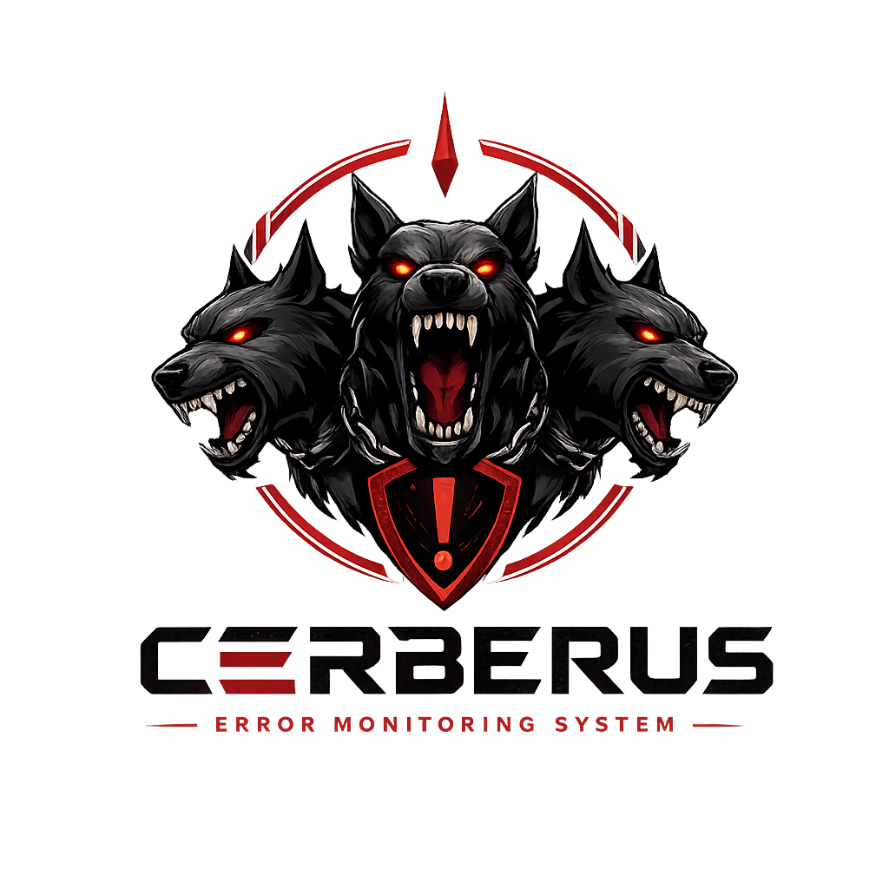

<p align="center">
  
</p>

<h1 align="center">Cerberus</h1>

**Cerberus** is a guard dog for your CI: SAST (Semgrep), secrets (Gitleaks), dependencies (Trivy), IaC misconfig (Checkov) and Dockerfile lint (Hadolint) in one container. It merges everything into a single SARIF report and fails the pipeline on qualifying findings — on a merge request, only ones in files the change touches; everywhere else, everything the scan finds.

> **Status: in production.** The image is published as `ghcr.io/startmatter/cerberus:latest` (linux/amd64 + arm64), the GitHub and GitLab wrappers are in use across the organization's repositories.

## Why another scanner wrapper

Running scanners in CI is easy. Living with the results is not: the first scan dumps hundreds of findings and every pipeline goes red. Cerberus stays fully standalone — no backend, no tracker, no tasks — and scopes the gate instead: a merge request only fails on findings in the files it actually touches, so a pre-existing backlog never blocks a merge. A default-branch push or a scheduled sweep gates on everything found, which is what lets a nightly dependency scan do its job — new CVEs land in code nobody touched, so a diff-scoped gate would never catch them. A tag/release pipeline never gates at all — that commit already earned its gate on the merge request; re-scanning it unscoped would fail releases over unrelated, pre-existing CVEs instead of anything the release changed.

## How it works

```
CI job ──▶ cerberus scan
             ├─ Semgrep   (SAST)
             ├─ Gitleaks  (secrets, whole history)
             ├─ Trivy     (dependencies, secrets, misconfig)
             ├─ Checkov   (IaC misconfig)
             ├─ Hadolint  (Dockerfiles)
             └─ custom    (anything that writes SARIF)
                   │ merge → one SARIF
                   ▼
             flatten + scope (merge request: changed files only; else: everything)
                   │
             report → job summary + PR/MR comment
                   │
             exit code by gate policy (fail_on: new-critical)
```

## Usage

**GitLab** — include the template:

```yaml
include:
  - remote: https://raw.githubusercontent.com/startmatter/cerberus/main/templates/gitlab-ci.yml
```

Set `CERBERUS_GITLAB_TOKEN` (a bot token with `api` scope, group-level) to get the scan report
posted as a merge-request comment — GitLab's own `CI_JOB_TOKEN` can't create one. Without it the
scan still runs and still gates; you just don't get the comment, only the job log. See the template
for details.

**GitHub** — call the reusable workflow:

```yaml
jobs:
  security:
    uses: startmatter/cerberus/.github/workflows/scan.yml@main
```

The scan report is posted as a pull-request comment when the caller's token may write to
pull requests, and lands in the job summary either way. Organizations that grant workflows
read-only access get the summary only — the scan itself always runs. Nothing to configure.

Or drive the action directly when you need control over the surrounding job:

```yaml
- uses: actions/checkout@v4
  with:
    fetch-depth: 0 # Gitleaks scans the whole history
- uses: startmatter/cerberus@main
  with:
    gate: "false" # informational only, never fails the job
    # dns: 1.1.1.1,8.8.8.8  # self-hosted runners whose resolver containers can't reach
```

CI context (repo, branch, commit, author, changed files) is detected from GitLab CI / GitHub Actions
environment variables. On a merge request the gate only counts findings in files the change touches
(diffed against the MR's real base — `CI_MERGE_REQUEST_DIFF_BASE_SHA` on GitLab, the merge-base with
the PR's base branch on GitHub); every other run counts everything the scan finds.

Add a nightly scheduled pipeline for dependency scanning: new CVEs land in code that never changed,
so pushes alone will not surface them.

### Self-hosted runners

If the runner sits behind a VPN resolver its containers cannot reach, Semgrep cannot fetch its rules
and Trivy cannot fetch its vulnerability database — and both quietly produce an empty report. Pass
`dns: 1.1.1.1,8.8.8.8` (GitHub) or set `--dns` on the runner's docker config (GitLab).

### Pulling a private image

Container packages are private by default, and some organizations disallow public ones. Then the
runner has to authenticate:

- **GitLab** — add a `DOCKER_AUTH_CONFIG` CI variable (group-level):
  `{"auths":{"ghcr.io":{"auth":"<base64 of user:token>"}}}` where the token is a GitHub PAT with
  `read:packages`.
- **GitHub, same organization** — nothing to do: the action logs in with the job's `GITHUB_TOKEN`.
  Give the job `permissions: packages: read`.
- **GitHub, another organization** — a repository's own token cannot read another org's private
  package. Pass a PAT with `read:packages` as the `REGISTRY_TOKEN` secret (reusable workflow) or
  `registry-token` input (action).

Configuration lives in [`cerberus.yml`](cerberus.example.yml) in the repo root — scanners, extra args,
custom SARIF-emitting checks, gate policy.

Locally: `docker run -v $(pwd):/src ghcr.io/startmatter/cerberus scan` — prints a findings table.
Local runs skip the gate by default (no CI context to scope against); pass `--config` pointed at a
real `cerberus.yml` to try policies, or read the report off stdout. Exit codes: 0 clean, 1 gate
failed, 2 runtime error.

## Design principles

- **Fully standalone.** No backend, no tracker, no state carried between runs. Every run scans everything it can see and decides everything for itself.
- **Scoped gate.** A merge request fails only on findings in files it touches. A pre-existing backlog elsewhere never blocks a merge. Default-branch pushes and scheduled sweeps gate on everything — that's the whole point of a nightly scan. Tag/release pipelines never gate — that commit already earned its gate on the merge request.
- **Says what it found.** Every run writes a report to the job summary (GitHub) or prints to the job log; on a pull/merge request it also posts the report as a comment (replacing its own previous one), with each finding's severity and location.
- **No second UI.** Triage happens by fixing the code and re-running the pipeline — there's nothing else to close or suppress.

## Roadmap

- [x] v0: CLI — run scanners, merge SARIF, gate on the response
- [x] Dockerfile with pinned scanner versions
- [x] GitLab CI template and GitHub composite action
- [x] Image published to ghcr.io on every push to main
- [x] Pull-request / merge-request comment + job summary with the findings table
- [x] Fully standalone: no backend, diff-scoped gate on merge requests, unscoped elsewhere
- [ ] More heads: license audit, Zizmor

Scanner rules (e.g. the Semgrep registry) are fetched at runtime and are licensed by their respective owners; Cerberus does not bundle them.

## License

[Apache-2.0](LICENSE)
